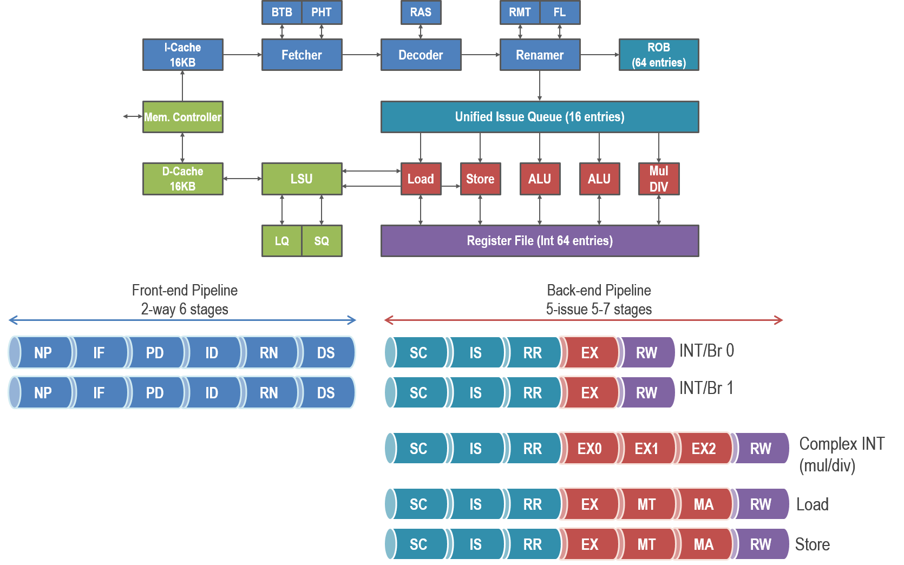
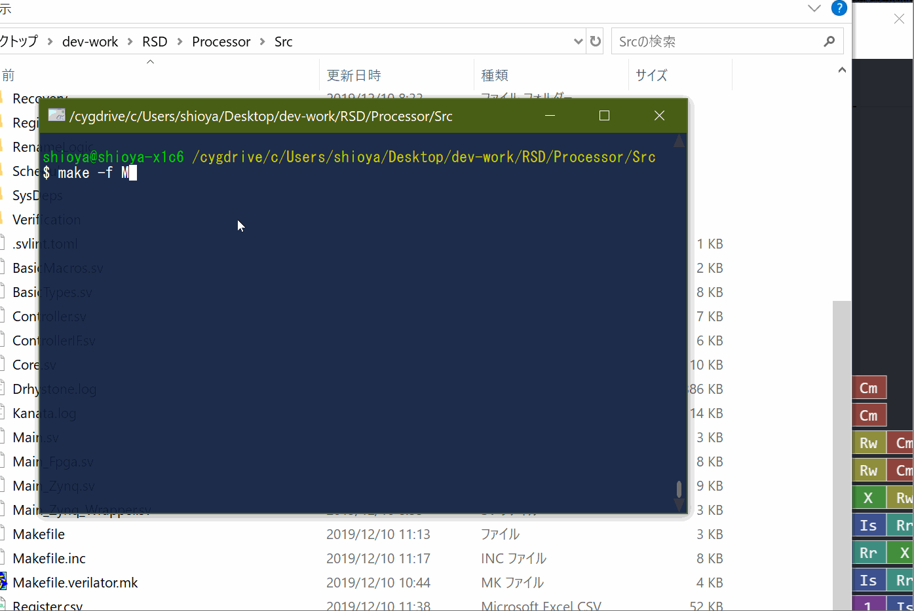

# RSD RISC-V Out-of-Order Superscalar Processor 

RSD is a 32-bit RISC-V out-of-order superscalar processor core.
RSD is very fast due to aggressive OoO features, while it is very compact and can be synthesized for small FPGAs. 
The key features of RSD are as follows:

* ISA
    * Support RV32IM 
    * Support Zephyr applications
* Microarchitecture
    * 2-fetch front-end and 5-issue back-end pipelines
    * Up to 64 instructions are in-flight.
        * These parameters can be configurable.
    * A high-speed speculative instruction scheduler with a replay mechanism
    * Speculative OoO load/store execution and dynamic memory disambiguation
    * Non-blocking L1 data cache
    * Support AXI4 bus
* Implementation
    * Written in SystemVerilog
    * Can be simulated with Mentor Modelsim/QuestaSim and Verilator
    * Can be synthesized with Synopsys Synplify and Design Compiler 
        * Design Compiler support is experimental
        * We are preparing the support for Xilinx Vivado.
    * FPGA optimized RAM structures
 



## Getting started 

1.  Install the following software for running simulation.    
    * GNU Make and Python
    * Cygwin (if you use Windows)
    * Verilator or Mentor Modelsim/QuestaSim

2. Refer to scripts in Processor/Tools/SetEnv and set environment variables.
    * Use SetEnv.bat on Windows or SetEnv.sh on Linux
    * RSD_ROOT must be set for running simulation.
    * For Windows, RSD_CYGWIN_PATH should also be set
    * Set RSD_QUESTASIM_PATH when using Modelsim/QuestaSim

3. Go to Processor/Src and make as follows.
    * For Verilator, add "-f Makefile.verilator" as follows.
        ```
        make -f Makefile.verilator
        make -f Makefile.verilator run        # run simulation
        make -f Makefile.verilator kanata     # run simulation & outputs a konata log file
        ```
    * For Modelsim/QuestaSim
        ```
        make
        make run        # run simulation
        make kanata     # run simulation & outputs a konata log file
        ```

4. If the simulation ran successfully, you find "kanata.log" in Processor/Src. 
    * Note that, the above sub-command is "kanata", not "konata".

5. You can see the execution pipeline of your simulation above with Konata.
    * Konata is a pipeline visualizer and can be downloaded from [here](https://github.com/shioyadan/Konata/releases) 
	* An example is shown below.
    * 


## License

Copyright 2019 Ryota Shioya (shioya@ci.i.u-tokyo.ac.jp) and RSD contributors, 
see also CREDITS.md. This implementation is released under the Apache License,
Version 2.0, see LICENSE for details. This implementation integrates third-party 
packages in accordance with the licenses presented in THIRD-PARTY-LICENSES.md.


## References

Susumu Mashimo, et al, "An Open Source FPGA-Optimized Out-of-Order RISC-V Soft 
Processor", IEEE International Conference on Field-Programmable Technology (FPT), 2019. A pre-print version is [here](http://sv.rsg.ci.i.u-tokyo.ac.jp/pdfs/Mashimo-FPT'19.pdf).

